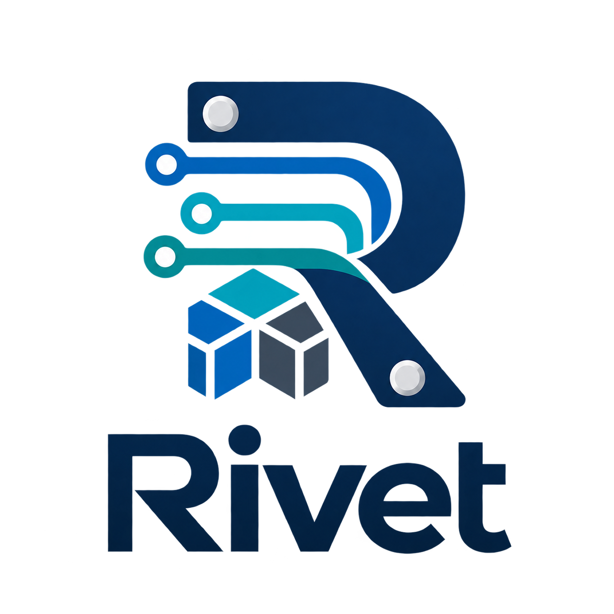

<div align="center">

  

  <h1>Rivet</h1>

  <p>
    <strong>Rust and Python image data pipeline</strong>
  </p>

</div>

Rivet is a Rust and Python image data pipeline for loading, transforming, and
batching datasets. It provides zero-copy tensor views where possible, bounded
multi-worker loading, deterministic sampling, and Lance-backed dataset support.

## Workspace crates

- `rivet-core` — tensor storage, layouts, and operations.
- `rivet-data` — dataset abstractions, sampling, caching, and runtime primitives.
- `rivet-vision` — image datasets, transforms, batching, and data loaders.
- `rivet-python` — Python bindings built with PyO3.

## Rust

Run the focused test suites with:

```bash
cargo test -j 8 -p rivet-core --lib
cargo test -j 8 -p rivet-data --lib
cargo test -j 8 -p rivet-vision --lib
```

The aligned-buffer microbenchmarks compare `Vec` construction and access
paths against the exact-size builder and validated Rivet kernels at five
scales from 3 KiB to 12 MiB:

```bash
cargo bench -j 12 -p rivet-core --bench aligned_buffer --features bench-internals
```

The Phase-0 pipeline baseline records first-batch latency and steady-state
throughput for decode, augmentation, normalization, CHW conversion, CIFAR,
and ImageNet-style workloads across worker and prefetch settings:

```bash
cargo run -j 12 -p rivet-vision --release --no-default-features \
  --example pipeline_baseline_bench
```

The image pipeline can be assembled from a dataset and compiled into a loader:

```rust
use rivet_vision::datasets::ImageFolderDatasetCore;
use rivet_vision::pipeline::ImagePipeline;
use std::sync::Arc;

let dataset = Arc::new(ImageFolderDatasetCore::new("data/images".into())?);
let mut loader = ImagePipeline::new(dataset)
    .decode_image()
    .resize(224, 224)
    .batch(32, false)
    .workers(4)
    .compile()?;

while let Some(batch) = loader.next_batch()? {
    println!("{} images", batch.images.dims()[0]);
}
# Ok::<(), Box<dyn std::error::Error>>(())
```

More complete examples are available in `crates/rivet-vision/examples`.

The fixed operator decomposition benchmark uses the local CIFAR-10 Arrow
cache with `batch=128` and `workers=4`:

```bash
RIVET_OPERATOR_BENCH_ITERS=100 \
  cargo run -j 12 -p rivet-vision --release --example operator_bench
```

Set `RIVET_OPERATOR_BENCH_ARROW` to select another CIFAR-10 Arrow file. The
benchmark reports latency, images/sec, allocation counts/bytes, and estimated
bytes copied for operations where the data movement is explicit.

The dtype stage benchmark compares per-sample conversion with the batch-stage
candidate:

```bash
RIVET_DTYPE_BENCH_ITERS=20 \
  cargo run -j 12 -p rivet-vision --release --example dtype_bench
```

Rust namespace migration:

- Use `rivet_vision::datasets`, `rivet_vision::transforms`, and
  `rivet_vision::pipeline` for the image implementation APIs.
- `rivet_vision::api` is the supported cross-module facade for integrations
  such as PyO3.
- Arrow storage types are scoped to
  `rivet_data::dataset::arrow::{ArrowRow, MmapArrowTable}`; they are not
  re-exported from the `rivet-data` crate root.

## Python

The Python package is built with Maturin. From a virtual environment:

```bash
python -m pip install maturin
maturin develop -j 8
```

Example:

```python
from rivet import vision

loader = (
    vision.scan_image_folder("data/images")
    .decode_image()
    .resize(224, 224)
    .batch(32)
    .workers(4)
    .execute()
)

for batch in loader:
    images = batch["images"]
    labels = batch["labels"]
    print(images.shape, labels.shape)

# Explicit zero-copy framework handoff:
dlpack_batch = loader.next_dlpack()
# Or, when torch is installed:
torch_batch = loader.next_torch()
```

Python batches expose read-only NumPy views by default. The views borrow the
Rust CPU allocation without copying and keep their owner alive through the
array base object. Use `DataLoader.next_dlpack()` for repeatable shared
DLPack producers or `DataLoader.next_torch()` for Torch tensors. A standard
`__dlpack__()` export is shared and repeatable; its versioned `READ_ONLY` flag
describes Rivet's immutable contract, but cannot prevent a consumer such as
Torch from attempting an in-place write. Each capsule is one-shot.

`into_dlpack()` is the explicit mutable ownership-transfer path: it succeeds
only when the Tensor handle and backing storage are both uniquely owned and
the backend is transferable. On success Rivet retains no Tensor alias, so the
consumer may mutate the allocation. Aliased views and read-only backends fail
with `BufferError` instead of silently copying. Rivet currently exports CPU
tensors only; unsupported dtype/device conversions fail explicitly instead of
silently copying.

`rivet` keeps the same names as a compatibility root during the migration;
new image code should use `rivet.vision`. No placeholder namespace is added
for modalities that do not yet have a public implementation.

Lance support is enabled by default and uses the native image schema (`image` plus
`label`) or the supported Hugging Face-compatible image struct.

## License

Licensed under either of:

- Apache License, Version 2.0
- MIT License

at your option.
