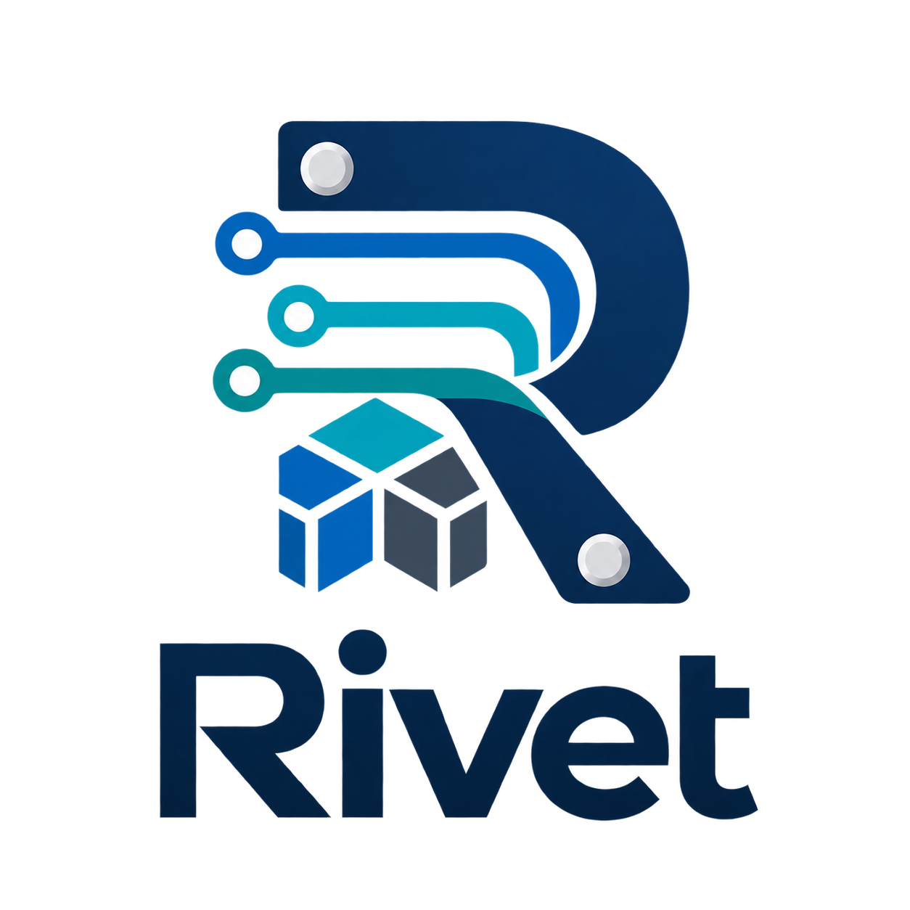

<div align="center">

  

  <h1>Rivet</h1>

  <p>
    <strong>Rust and Python image data pipeline</strong>
  </p>

</div>

Rivet is a Rust and Python image data pipeline for loading, transforming, and
batching datasets. It provides zero-copy tensor views where possible, bounded
multi-worker loading, deterministic sampling, and Lance-backed dataset support.

The Rust [pipeline IR](docs/pipeline-ir.md) supports executable DAGs with shared
inputs and image branch joins, while retaining the CPU linear fast path.

## Workspace crates

- `rivet-core` — tensor storage, layouts, and operations.
- `rivet-data` — dataset abstractions, sampling, caching, and runtime primitives.
- `rivet-vision` — image datasets, transforms, batching, and data loaders.
- `rivet-python` — Python bindings built with PyO3.

## Rust

CPU F32/F64 matrix multiplication uses the Rust `gemm` crate by default. Enable
the `rivet-core` feature `blas` to use native CBLAS instead:

```toml
rivet-core = { version = "0.1.0", features = ["blas"] }
```

The optional `rivet-blas-sys` binding defaults to dynamic LP64 FlexiBLAS.
Install the FlexiBLAS development package so `pkg-config --libs flexiblas`
works (for example, `flexiblas-devel` on Fedora). The resulting binary also
requires the FlexiBLAS runtime. Both paths support CPU F32/F64 matrices,
including offset, transposed, and padded views. Regular layouts use native
kernels directly; other layouts use typed fallback loops without input copies.
With `blas`, a single output column (including `mv`) uses `sgemv`/`dgemv`. F32/F64
`dot` and `norm` use native vector reductions for supported layouts: `dot`
accepts positive-stride vectors, while `norm` also accepts contiguous tensors
of any rank. F32 `dot` uses `dsdot` to retain double-precision accumulation.
Other dtypes, zero-stride broadcasts, and general strided norms use the
existing kernels. BLAS reductions can differ in rounding; `nrm2` also avoids
some overflow/underflow cases of a direct sum of squares.

```bash
cargo build -j 12 -p rivet-core --lib --features blas
```

`rivet-vision` and the Python extension forward their `blas` feature to
`rivet-core`. Enable it for a Rust vision build or a Python extension build:

```bash
cargo build -j 12 -p rivet-vision --lib --features blas
maturin develop --release -j 12 --features blas
maturin build --release -j 12 --features blas
```

Lance remains enabled by default; add `--no-default-features` to build without
Lance. BLAS is a Cargo build feature selected when compiling the extension.

Compare vector reductions and matrix-vector multiplication in release mode:

```bash
OPENBLAS_NUM_THREADS=1 OMP_NUM_THREADS=1 cargo bench -j 12 -p rivet-core \
  --bench blas_ops -- --save-baseline default
FLEXIBLAS=OPENBLAS-SERIAL OPENBLAS_NUM_THREADS=1 OMP_NUM_THREADS=1 cargo bench -j 12 -p rivet-core \
  --bench blas_ops --features blas -- --baseline default
```

The BLAS comparison selects FlexiBLAS's `OPENBLAS-SERIAL` backend explicitly;
use an installed backend name from `flexiblas list` on other systems.

Compare the original GEMM kernel and the BLAS kernel side by side in one
process, including identical checks and aligned output allocation:

```bash
RAYON_NUM_THREADS=1 FLEXIBLAS=OPENBLAS-SERIAL OPENBLAS_NUM_THREADS=1 OMP_NUM_THREADS=1 \
  cargo bench -j 12 -p rivet-core --bench matmul_backends --features blas,bench-internals
```

The benchmark checks matching results before timing square, rectangular, and
matrix-vector shapes. `gemm` uses the original Rayon policy; the command fixes
Rayon and BLAS to one thread. For a parallel comparison, select a threaded
FlexiBLAS backend and set both thread counts to the same value. Inputs are
allocated once; every measured call allocates a fresh output. Criterion's
elements/s here represents FLOP/s using the conventional `2*m*k*n` count.

### CPU linear algebra

These methods support F32/F64 with matching dtypes and devices. New fused and
structured operations are CPU-only. Shapes are strict; `addmm`, `addmv`, and
`addr` do not broadcast their addend. Coefficients are converted to the tensor
dtype, and zero coefficients ignore the corresponding operand values.

| Method | Operation | BLAS path |
| --- | --- | --- |
| `c.addmm(&a, &b, alpha, beta)` | `beta*C + alpha*A*B` | GEMM |
| `y.addmv(&a, &x, alpha, beta)` | `beta*y + alpha*A*x` | GEMV |
| `x.outer(&y)` | `x*y^T` | GER |
| `a.addr(&x, &y, alpha, beta)` | `beta*A + alpha*x*y^T` | GER |
| `x.norm_l1()` | Sum of absolute values | ASUM |
| `a.gram(true)` / `a.gram(false)` | `A^T*A` / `A*A^T` | SYRK, then mirror triangle |
| `a.symmetric_matmul(&b, upper)` | Symmetric `A*B` using one triangle | SYMM |
| `a.symmetric_mv(&x, upper)` | Symmetric `A*x` using one triangle | SYMV |
| `a.triangular_solve(&b, upper, unit_diagonal)` | Solve `A*X=B`, vector or matrix RHS | TRSM |

`upper=true` selects the upper triangle; the other triangle is ignored. A unit
diagonal ignores stored diagonal values. Otherwise triangular solve reports an
exactly zero diagonal as `SingularMatrix`. Gram returns a full symmetric matrix.
BLAS reductions may have different rounding from the default kernels.

Immutable tensors retain their shared-storage semantics. In-place vector
updates require exclusive contiguous CPU storage and support offset views:

```rust
let mut owned = tensor.try_into_exclusive().unwrap();
owned.axpy(0.5, &x)?; // owned += 0.5 * x; AXPY when available
owned.scale(2.0)?;   // owned *= 2; SCAL when available
let tensor = owned.into_tensor(); // no allocation or storage copy
```

`axpy` requires exact shape/dtype/device matching. Non-contiguous sources use
a typed fallback. A zero `scale` clears the view, including NaNs; values outside
the view are preserved. Shared tensors must release aliases before exclusive
transfer succeeds. CPU `broadcast_matmul` retains broadcast views and writes
every batch directly into one final allocation.

Compare fused vs. composed operations and direct vs. legacy batch output:

```bash
RAYON_NUM_THREADS=1 OPENBLAS_NUM_THREADS=1 OMP_NUM_THREADS=1 \
  cargo bench -j 12 -p rivet-core --bench linalg_ops -- --save-baseline default
RAYON_NUM_THREADS=1 FLEXIBLAS=OPENBLAS-SERIAL OPENBLAS_NUM_THREADS=1 OMP_NUM_THREADS=1 \
  cargo bench -j 12 -p rivet-core --bench linalg_ops --features blas -- --baseline default
```

Run the focused test suites with:

```bash
cargo test -j 8 -p rivet-core --lib
cargo test -j 8 -p rivet-data --lib
cargo test -j 8 -p rivet-vision --lib
```

The aligned-buffer microbenchmarks compare `Vec` construction and access
paths against the exact-size builder and validated Rivet kernels at five
scales from 3 KiB to 12 MiB:

```bash
cargo bench -j 12 -p rivet-core --bench aligned_buffer --features bench-internals
```

The Phase-0 pipeline baseline records first-batch latency and steady-state
throughput for decode, augmentation, normalization, CHW conversion, CIFAR,
and ImageNet-style workloads across worker and prefetch settings:

```bash
cargo run -j 12 -p rivet-vision --release --no-default-features \
  --example pipeline_baseline_bench
```

The image pipeline can be assembled from a dataset and compiled into a loader:

```rust
use rivet_vision::datasets::ImageFolderDatasetCore;
use rivet_vision::pipeline::ImagePipeline;
use std::sync::Arc;

let dataset = Arc::new(ImageFolderDatasetCore::new("data/images".into())?);
let mut loader = ImagePipeline::new(dataset)
    .decode_image()
    .resize(224, 224)
    .batch(32, false)
    .workers(4)
    .compile()?;

while let Some(batch) = loader.next_batch()? {
    println!("{} images", batch.images.dims()[0]);
}
# Ok::<(), Box<dyn std::error::Error>>(())
```

More complete examples are available in `crates/rivet-vision/examples`.

To convert a local Hugging Face Arrow cache into Rivet-native Lance splits:

```bash
cargo run -j 12 -p rivet-vision --features lance \
  --example convert_hf_lance -- \
  /path/to/huggingface/datasets
```

The converter discovers common `train`, `validation`, and `test` shard names,
normalizes the image bytes and integer labels, writes one `.lance` directory
per split under `~/.cache/rivet/datasets/<dataset-name>`, and creates the Rivet
`dataset.json` manifest. Each physical Lance data file targets a maximum of 2
GiB and 1,048,576 rows by default; Lance checks the byte limit at row-group
boundaries, so the final file can be slightly larger. Override these settings
with `--max-bytes-per-file <bytes>` and `--max-rows-per-file <rows>`. Pass an
output path to override the default. Use `--image-column`, `--label-column`,
`--keep-path`, or `--overwrite` when needed.

The fixed operator decomposition benchmark uses the local CIFAR-10 Arrow
cache with `batch=128` and `workers=4`:

```bash
RIVET_OPERATOR_BENCH_ITERS=100 \
  cargo run -j 12 -p rivet-vision --release --example operator_bench
```

Set `RIVET_OPERATOR_BENCH_ARROW` to select another CIFAR-10 Arrow file. The
benchmark reports latency, images/sec, allocation counts/bytes, and estimated
bytes copied for operations where the data movement is explicit.

The dtype stage benchmark compares per-sample conversion with the batch-stage
candidate:

```bash
RIVET_DTYPE_BENCH_ITERS=20 \
  cargo run -j 12 -p rivet-vision --release --example dtype_bench
```

Rust namespace migration:

- Use `rivet_vision::datasets`, `rivet_vision::transforms`, and
  `rivet_vision::pipeline` for the image implementation APIs.
- `rivet_vision::api` is the supported cross-module facade for integrations
  such as PyO3.
- Arrow storage types are scoped to
  `rivet_data::dataset::arrow::{ArrowRow, MmapArrowTable}`; they are not
  re-exported from the `rivet-data` crate root.

## Python

The Python package is built with Maturin. From a virtual environment:

```bash
python -m pip install maturin
maturin develop -j 8
```

Example:

```python
from rivet import vision

loader = (
    vision.scan_image_folder("data/images")
    .decode_image()
    .resize(224, 224)
    .batch(32)
    .workers(4)
    .execute()
)

for batch in loader:
    images = batch["images"]
    labels = batch["labels"]
    print(images.shape, labels.shape)

# Explicit zero-copy framework handoff:
dlpack_batch = loader.next_dlpack()
# Or, when torch is installed:
torch_batch = loader.next_torch()
```

Python batches expose read-only NumPy views by default. The views borrow the
Rust CPU allocation without copying and keep their owner alive through the
array base object. Use `DataLoader.next_dlpack()` for repeatable shared
DLPack producers or `DataLoader.next_torch()` for Torch tensors. A standard
`__dlpack__()` export is shared and repeatable; its versioned `READ_ONLY` flag
describes Rivet's immutable contract, but cannot prevent a consumer such as
Torch from attempting an in-place write. Each capsule is one-shot.

`into_dlpack()` is the explicit mutable ownership-transfer path: it succeeds
only when the Tensor handle and backing storage are both uniquely owned and
the backend is transferable. On success Rivet retains no Tensor alias, so the
consumer may mutate the allocation. Aliased views and read-only backends fail
with `BufferError` instead of silently copying. Rivet currently exports CPU
tensors only; unsupported dtype/device conversions fail explicitly instead of
silently copying.

`rivet` keeps the same names as a compatibility root during the migration;
new image code should use `rivet.vision`. No placeholder namespace is added
for modalities that do not yet have a public implementation.

Lance support is enabled by default and uses the native image schema (`image` plus
`label`) or the supported Hugging Face-compatible image struct.

## License

Licensed under either of:

- Apache License, Version 2.0
- MIT License

at your option.
